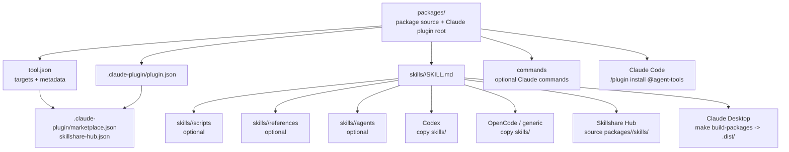

# Distribution Targets

This repo keeps package source in one place and lets each target consume that
source directly whenever possible.

## Source To Targets



## Target Shapes

Claude Code consumes the package root:

```text
packages/<name>/
  .claude-plugin/plugin.json
  skills/<name>/SKILL.md
  skills/<name>/scripts/
  skills/<name>/references/
  skills/<name>/agents/
  commands/
  README.md
```

Codex consumes the skill folder:

```text
packages/<name>/skills/<name>/
  SKILL.md
  scripts/
  references/
  agents/
```

OpenCode and generic Agent Skills consume the same skill folder:

```text
packages/<name>/skills/<name>/
```

Claude Desktop / claude.ai custom skills need lowercase `skill.md`, so the
local artifact builder creates:

```text
.dist/claude/custom-skills/<name>/
  skill.md
  scripts/
  references/
  agents/
  README.md
  LICENSE
```

`.dist/` is ignored and not committed.

## What Is Shared

Codex, OpenCode, generic Agent Skills, and Skillshare use the same source skill
folder. Claude Code uses the package root because it also needs plugin metadata
and commands. Claude Desktop uses a local artifact because its filename
expectation differs.

## Update Rule

Edit only source paths during normal development:

```text
packages/<name>/
```

Then run:

```sh
make build-packages
make public-check
```
