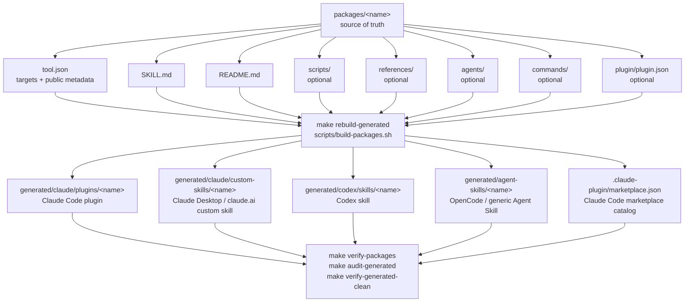
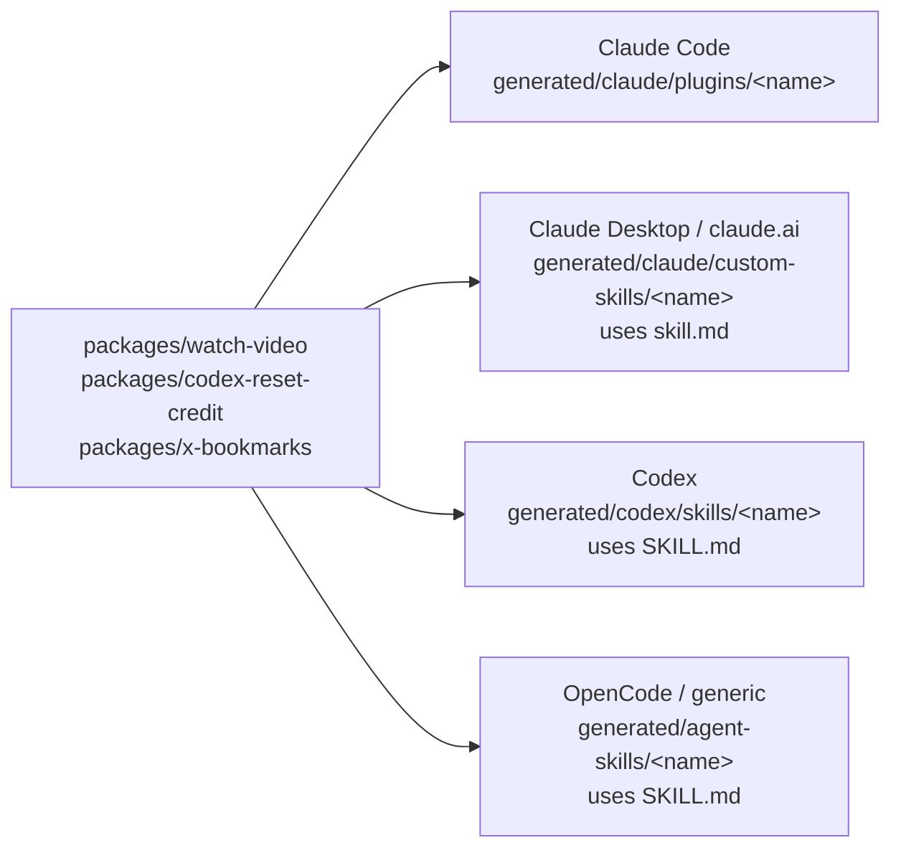

# Distribution Targets

This repo keeps package source in one place and generates multiple public
install targets from it. The generated targets are committed for convenience,
but they are not source of truth.

For the full new-skill onboarding checklist, use
[`adding-a-skill.md`](adding-a-skill.md).

Some targets share the same core shape, and each target has a small wrapper or
layout difference.

All generated package targets share:

- `README.md`
- `LICENSE`
- skill instructions generated from `packages/<name>/SKILL.md`
- `scripts/` when the source package has scripts
- `references/` when the source package has references
- `agents/` when the source package has agent UI metadata
- `GENERATED.md` marker

Target differences:

- Claude Code plugin adds `.claude-plugin/plugin.json`, nests the skill under
  `skills/<name>/`, and can include Claude command files under `commands/`.
- Claude Desktop / claude.ai custom skill uses lowercase `skill.md` for ZIP
  upload.
- Codex skill uses top-level `SKILL.md`.
- OpenCode / generic Agent Skill also uses top-level `SKILL.md`.

## Source To Targets



## Target Shapes

All generated targets share the same package source:

```text
packages/<name>/README.md
packages/<name>/SKILL.md
packages/<name>/scripts/        optional
packages/<name>/references/     optional
packages/<name>/agents/         optional
LICENSE
```

Each target wraps that source differently.

Claude Code plugin:

```text
generated/claude/plugins/<name>/
  .claude-plugin/plugin.json
  skills/<name>/SKILL.md
  skills/<name>/scripts/
  skills/<name>/references/
  skills/<name>/agents/
  commands/
  README.md
  LICENSE
  GENERATED.md
```

Claude Desktop / claude.ai custom skill:

```text
generated/claude/custom-skills/<name>/
  skill.md
  scripts/
  references/
  agents/
  README.md
  LICENSE
  GENERATED.md
```

Codex skill:

```text
generated/codex/skills/<name>/
  SKILL.md
  scripts/
  references/
  agents/
  README.md
  LICENSE
  GENERATED.md
```

OpenCode / generic Agent Skill:

```text
generated/agent-skills/<name>/
  SKILL.md
  scripts/
  references/
  agents/
  README.md
  LICENSE
  GENERATED.md
```

Optional directories are present only when the source package has them. The
`GENERATED.md` file inside each target lists the exact source paths that
produced that target.

## What Is Shared

Codex and OpenCode/generic targets are the closest shape match. They both use a
top-level `SKILL.md` plus optional source directories.

Claude Desktop / claude.ai custom skill is similar, but uses lowercase
`skill.md`. Keep it in a separate generated tree because macOS default
filesystems can collapse `SKILL.md` and `skill.md` into the same file.

Claude Code is the most different target. It needs plugin metadata,
`skills/<name>/SKILL.md`, and optional Claude command files.

## Edit Rule

Edit only source paths during normal development:

```text
packages/<name>/
```

Do not hand-edit generated outputs:

```text
generated/claude/plugins/<name>/
generated/claude/custom-skills/<name>/
generated/codex/skills/<name>/
generated/agent-skills/<name>/
.claude-plugin/marketplace.json
```

To update generated outputs:

```sh
make rebuild-generated
make verify-packages
make audit-generated
make verify-generated-clean
```

`make rebuild-generated` deletes `.claude-plugin/` and `generated/`, then
recreates them from `packages/`. That is intentional: generated files should
inherit source-path wording and generated notices from the builder scripts, not
from manual edits.

## Per-Package Flow



## Generation Sequence

```mermaid
sequenceDiagram
  participant Dev as Human/Agent
  participant Src as packages/&lt;name&gt;
  participant Build as make rebuild-generated
  participant Gen as generated/ + .claude-plugin/
  participant Verify as verify/audit checks

  Dev->>Src: Edit SKILL.md, README.md, scripts, references, agents, commands, plugin metadata
  Dev->>Build: Run make rebuild-generated
  Build->>Gen: Delete generated roots and recreate from source
  Gen->>Verify: Run verify-packages + audit-generated + verify-generated-clean
  Verify-->>Dev: Pass means generated outputs match source
```
